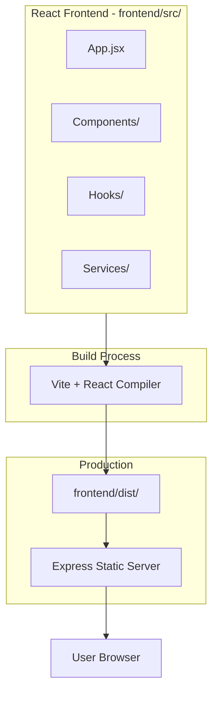
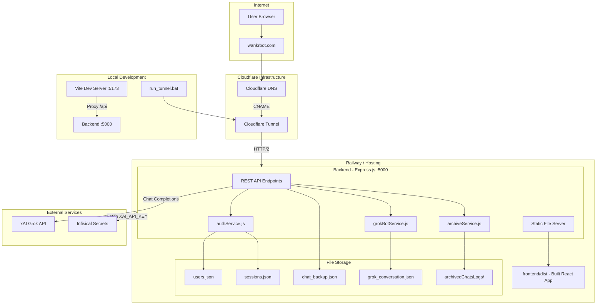
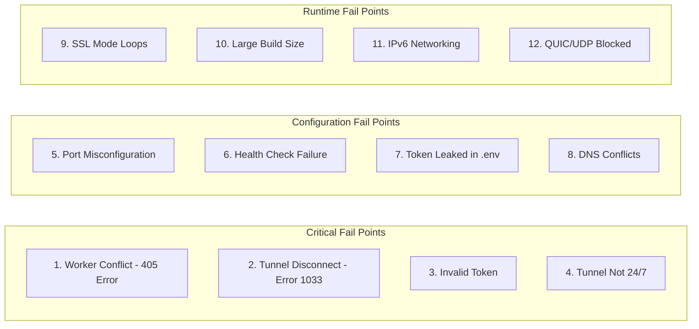
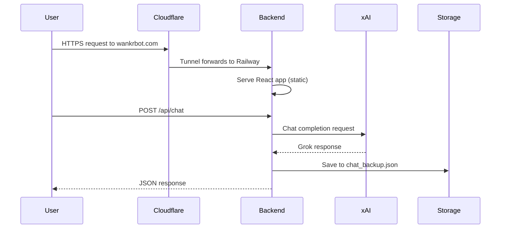

# Wankr Application Architecture

## System Overview

The wankr application is a full-stack AI chat interface that uses xAI's Grok API, with file-based persistence and Cloudflare Tunnel for production access.

---

## React Frontend

The UI is a **React 19** app (Vite) that talks to the backend over REST.

| Context | Where React runs | How it reaches the API |
|--------|-------------------|-------------------------|
| **Production** | Built to `frontend/dist/`, served by Express static server | Same origin; requests go to `/api/*` on the same host |
| **Development** | Vite dev server on port 5173 | Vite proxies `/api/*` to backend at `http://127.0.0.1:5000` |

**Source:** `frontend/src/` — App.jsx, components (LoginScreen, ChatPanel, Sidebar, TrainingPanel, SpectatorView), hooks, and services (chatService, authService, trainingService).

---

## Architecture Diagram

---

## Component Connections

| From           | To              | Connection Type |
| -------------- | --------------- | --------------- |
| User Browser   | wankrbot.com    | HTTPS           |
| Cloudflare DNS | Tunnel          | CNAME record    |
| Tunnel         | Railway Backend | HTTP/2          |
| Backend        | xAI API         | HTTPS REST      |
| Backend        | Infisical       | HTTPS SDK       |
| Frontend       | Backend         | `/api/*` proxy  |
| Services       | Storage         | File I/O        |

---

## Main Fail Points (12 Identified)

---

## Fail Point Details

### Critical (Service Down)

1. **405 Method Not Allowed** — Cloudflare Worker still attached to domain conflicts with Tunnel  
   - **Location:** Cloudflare Dashboard > Workers & Pages > Domains  
   - **Fix:** Remove domain from Workers routes  

2. **Error 1033 - Unable to Resolve** — Tunnel not connected or token invalid  
   - **Location:** `CLOUDFLARE_TUNNEL_TOKEN` in Railway/`.env`  
   - **Fix:** Get fresh Run token from Zero Trust dashboard  

3. **Invalid Tunnel Secret** — Using wrong token type (Install vs Run)  
   - **Location:** run_tunnel.bat, Railway env vars  
   - **Fix:** Copy token from Run command, not Install connector  

4. **Tunnel Persistence** — Local tunnel stops when PC sleeps  
   - **Location:** Local dev environment  
   - **Fix:** Deploy cloudflared as Railway service for 24/7 uptime  

### Configuration (Deploy Failures)

5. **Port Misconfiguration** — Hardcoded port causes Railway crash  
   - **Location:** wankr-backend/server.js  
   - **Fix:** Use `process.env.PORT || 5000`  

6. **Health Check Failure** — Railway marks app crashed  
   - **Location:** railway.json + backend `/health` endpoint  
   - **Fix:** Ensure `/health` returns 200 OK  

7. **Token Security** — Token committed to git  
   - **Location:** `.env` file  
   - **Fix:** Keep `.env` in `.gitignore`, use Railway Variables  

8. **DNS Conflicts** — Old A/CNAME records block Tunnel  
   - **Location:** Cloudflare DNS settings  
   - **Fix:** Remove all non-tunnel records for `@` and `www`  

### Runtime (Intermittent Issues)

9. **SSL Mode Loops** — Wrong SSL setting causes redirect loops  
   - **Location:** Cloudflare SSL/TLS settings  
   - **Fix:** Use Full (strict) + Always Use HTTPS  

10. **Build Size** — Single-stage Dockerfile bloats image  
    - **Location:** Dockerfile  
    - **Fix:** Multi-stage build (already implemented)  

11. **IPv6/Networking** — Railway internal networking issues  
    - **Location:** Tunnel public hostname config  
    - **Fix:** Use backend's public HTTPS URL instead of internal  

12. **QUIC/UDP Failures** — Blocked by Windows firewall  
    - **Location:** run_tunnel.bat  
    - **Fix:** Use `--protocol http2` (already implemented)  

---

## Data Flow Summary

---

## Key Files

- **Backend entry:** wankr-backend/server.js  
- **Frontend entry:** frontend/src/App.jsx  
- **API config:** frontend/src/config/apiConfig.js  
- **Deployment:** Dockerfile, railway.json  
- **Tunnel script:** run_tunnel.bat  
- **Troubleshooting:** docs/DEPLOYMENT_REVIEW.md  
