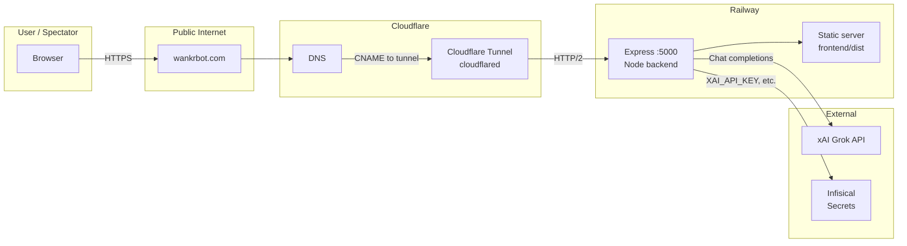
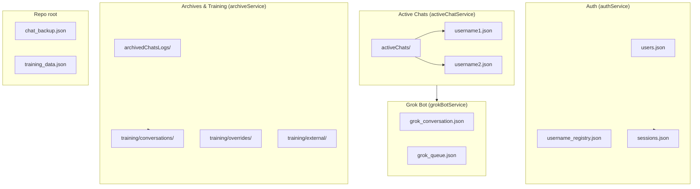
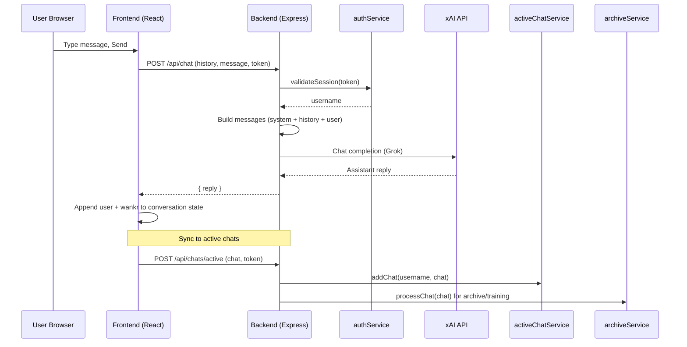
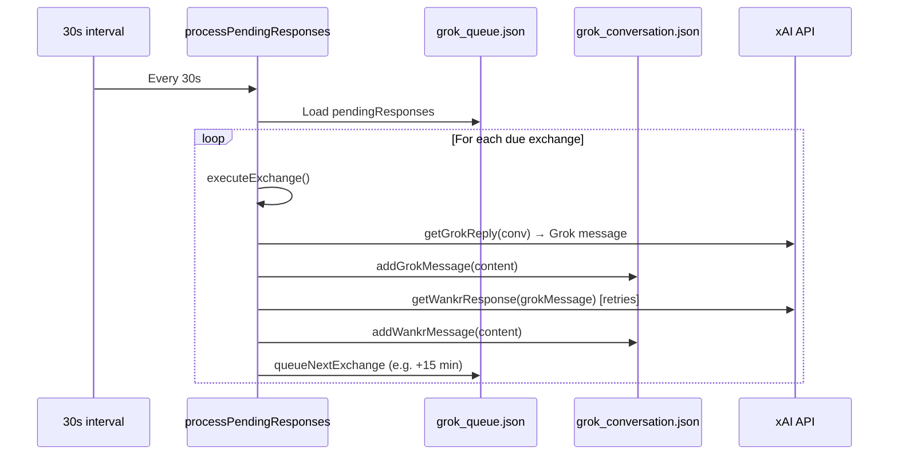
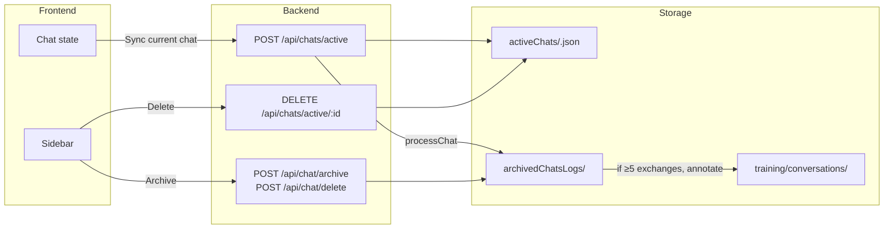
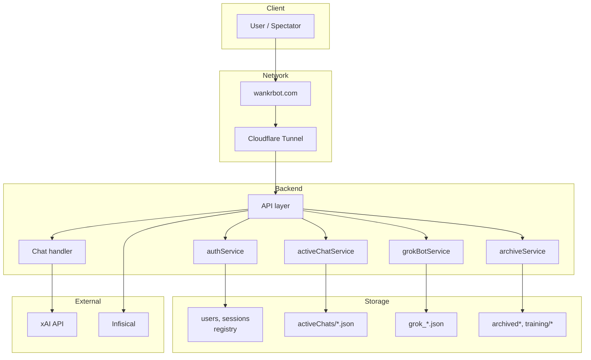

# Wankr Network, Storage & Information Flow

This document describes how the Wankr system is wired: network topology, storage layout, and the flow of information for chat, spectator mode, the Grok bot, and archives.

---

## 1. System Overview

Wankr is a full-stack AI chat application:

- **Frontend:** React (Vite) — login, chat panel, sidebar (archives), spectator view (Wankr Vision), training panel.
- **Backend:** Node.js (Express) — auth, chat with xAI Grok, active chats, archives, Grok bot, spectator API.
- **Secrets:** xAI API key (and optional training key) from **Infisical** first, then `.env` fallback.
- **Production:** Frontend is built to `frontend/dist/` and served by the same Express server. Public access is **wankrbot.com** via **Cloudflare Tunnel** to **Railway**.

---

## 2. Network Topology



**Flow in words:**

1. User opens **https://wankrbot.com** in the browser.
2. DNS resolves wankrbot.com to Cloudflare; the **Tunnel** (cloudflared) receives traffic and forwards it to the **Railway** backend (single origin).
3. The backend serves the React app (static files) and handles all `/api/*` requests.
4. Chat and Grok bot use the **xAI** API; the backend loads **XAI_API_KEY** from Infisical (or `.env`).

**Important:** No Cloudflare Worker should be attached to wankrbot.com; the Tunnel must own the hostname so full API and WebSocket behavior work.

---

## 3. Storage Layout

All persistent data is file-based under the repo/backend. Paths are relative to the **backend process** (e.g. `wankr-backend/` when run from repo root, or Railway’s workspace).

### 3.1 Auth & identity (authService)

| Path | Purpose |
|------|--------|
| `wankr-backend/storage/users.json` | Registered users: `username`, `passwordHash`, optional `email`, `createdAt`. |
| `wankr-backend/storage/username_registry.json` | Reserved usernames (one source of truth for “taken”). |
| `wankr-backend/storage/sessions.json` | Active sessions: token → `{ username, createdAt, expiresAt }`. Session TTL 7 days. |

Used for: login, register, session validate, logout, and **getActiveUsernames()** (spectator “live” list).

### 3.2 Active chats (activeChatService)

| Path | Purpose |
|------|--------|
| `wankr-backend/storage/activeChats/<username>.json` | One file per user: array of up to **20** active chats. Each chat: `id`, `name`, `messages[]`, `createdAt`, `updatedAt`. |

- **Messages** are the same shape as in the UI: `role` (‘user’ / ‘wankr’), `content`.
- When the user has more than 20 chats, the oldest is evicted (overflow can be sent to archive).
- Hourly cleanup removes “stale” chats (e.g. &lt; 5 exchanges and idle 7+ days).

Used for: sidebar “active” chats (recall, continue), and **spectator** conversation for real users (latest chat by `updatedAt`).

### 3.3 Grok bot (grokBotService)

| Path | Purpose |
|------|--------|
| `wankr-backend/storage/grok_conversation.json` | Single Grok↔Wankr conversation: `messages[]` (from ‘grok’ / ‘wankr’), `lastActivity`. |
| `wankr-backend/storage/grok_queue.json` | Pending exchanges: `pendingResponses[]` with `scheduledTime` (e.g. every 15 minutes). |

Used for: automated training dialogue and **spectator** view of Grok (user id `grok`).

### 3.4 Chat backup (restart recovery)

| Path | Purpose |
|------|--------|
| `chat_backup.json` (repo root) | Single file: `{ messages, currentId }`. Written by frontend before restart; read once on load then deleted. |

Used for: restoring in-progress conversation after a restart (e.g. deploy). Not per-user; one backup per instance.

### 3.5 Archives & training (archiveService)

| Path | Purpose |
|------|--------|
| `wankr-backend/storage/archivedChatsLogs/` | Archived chats (e.g. when user archives or overflows from active). |
| `wankr-backend/storage/deletedChatsLogs/` | Deleted chats (for audit). |
| `wankr-backend/storage/wankrChatLogs_annotated/` | Grok-annotated logs. |
| `wankr-backend/storage/wankrChatLog_Errors/` | Archive/annotation errors. |
| `wankr-backend/storage/userChats/` | User chat storage used by archive pipeline. |
| `wankr-backend/storage/training/conversations/` | Compressed training conversations (`.json.gz`). |
| `wankr-backend/storage/training/overrides/` | Override files for training. |
| `wankr-backend/storage/training/external/` | External training data. |
| `wankr-backend/storage/training/manifest.json` | Manifest for training sources. |

Archive rules (simplified): when a chat is archived or evicted from active, if it has **≥ 5 exchanges** it is written to archive and can be annotated and pushed to **training/conversations**; otherwise it can be discarded.

### 3.6 Other files

| Path | Purpose |
|------|--------|
| `training_data.json` (repo root) | Training payloads submitted via `/api/train` (e.g. messages + system_prompt). |
| `wankr-backend/logs/chat.log` | Append-only chat log. |
| `wankr-backend/logs/flagged_accounts.json` | Privacy/flagging (if used). |
| `restart_requested.flag` (repo root) | Restart signal file. |

### 3.7 Storage diagram



---

## 4. Information Flow

### 4.1 User chat (send message → reply)



- **Session:** Token is validated; username is taken from **sessions** (no trust of client-supplied username for auth).
- **Chat:** One POST to `/api/chat`; backend calls xAI and returns the reply. Frontend then syncs the current conversation to **active chats** via `/api/chats/active`; the backend may also push to archive/training pipeline.

### 4.2 Spectator (Wankr Vision) — who is “live” and what they see

```mermaid
sequenceDiagram
    participant S as Spectator Browser
    participant F as SpectatorView (React)
    participant B as Backend
    participant Auth as authService
    participant Grok as grokBotService
    participant Active as activeChatService

    S->>F: Open Wankr Vision
    F->>B: GET /api/spectator/users
    B->>Grok: getActiveUsers()
    B->>Auth: getActiveUsernames()
    B->>Active: getChats(username) per user
    B-->>F: { users: [grok, user1, user2, ...] }
    F->>F: Show user list (newest at bottom, scroll up)

    S->>F: Click user (e.g. Bitcoin)
    F->>B: GET /api/spectator/conversation/Bitcoin
    B->>Active: getChats(Bitcoin), latest by updatedAt
    B-->>F: { conversation: { messages } }
    F->>F: Render literal messages (no skew), scroll to bottom
    F->>F: Poll every 5s; preserve scroll if user scrolled up
```

- **Live list:** “Active” = Grok (always) + every username with at least one valid **session** (from authService). So “logged in” = appears in Wankr Vision.
- **Conversation:** For **grok**, backend returns `grok_conversation.json`. For a **real user**, backend returns the **latest active chat** (by `updatedAt`) from `activeChats/<username>.json`. Messages are returned in the same order and shape as in the actual chat (literal copy).
- **UI:** Newest at bottom; scroll starts at bottom; user can scroll up; polling restores scroll position so it doesn’t jump.

### 4.3 Grok bot (automated Grok↔Wankr training)



- **Scheduling:** Stored in **grok_queue.json** (e.g. next run in 15 minutes). Processor runs every 30s and runs any due exchanges.
- **Exchange:** One Grok message + one Wankr reply (each from xAI). Wankr uses the same system prompt as main chat; Grok uses a training-focused persona so questions force clear, evidence-based answers.
- **Secrets:** xAI key is loaded at startup (Infisical first, then `.env`); Grok bot only starts if the key is present.

### 4.4 Active chats and archive pipeline



- **Active:** Frontend syncs the current conversation to `/api/chats/active`; backend updates **activeChats/<user>.json** (cap 20, evict oldest). Overflow and “stored” chat can be sent to **archiveService** (archivedChatsLogs, optional annotation, training).
- **Archive/delete:** Archive and delete APIs drive archiveService and (for delete) removal from active; training ingestion follows archive rules.

---

## 5. API Summary (relevant to network and storage)

| Area | Method | Endpoint | Purpose |
|------|--------|----------|---------|
| Health | GET | `/api/health` | Backend + app ok. |
| Auth | POST | `/api/auth/register`, `/api/auth/login` | Register, login (writes users, registry, sessions). |
| Auth | GET | `/api/auth/session` | Validate token (reads sessions). |
| Auth | POST | `/api/auth/logout` | Destroy session (writes sessions). |
| Chat | POST | `/api/chat` | Send message, get Wankr reply (xAI); uses session. |
| Chat | POST/GET | `/api/chat/backup`, `/api/chat/restore` | Restart backup (single file in repo root). |
| Active chats | GET | `/api/chats/active` | List active chats for user (activeChatService). |
| Active chats | POST | `/api/chats/active` | Add/update chat (activeChatService + archive pipeline). |
| Active chats | DELETE | `/api/chats/active/:chatId` | Remove chat (activeChatService + archive). |
| Archive | POST | `/api/chat/archive`, `/api/chat/delete` | Silent archive/delete (archiveService). |
| Spectator | GET | `/api/spectator/users` | Live list (Grok + getActiveUsernames + activeChatService). |
| Spectator | GET | `/api/spectator/conversation/:userId` | Conversation for Grok or real user (grok_conversation or activeChats). |
| Spectator | GET | `/api/spectator/grok-status` | Grok bot status (queue, next run). |
| Grok bot | POST | `/api/grok/exchange`, `/api/grok/process-pending`, etc. | Trigger exchange, process queue, seed, clear, kill. |

---

## 6. Secrets and configuration

- **Infisical (preferred):** Backend loads **XAI_API_KEY** (or **grokWankr**) from Infisical using `INFISICAL_CLIENT_ID`, `INFISICAL_CLIENT_SECRET`, `INFISICAL_PROJECT_ID`, and optional `INFISICAL_ENVIRONMENT`. Used for chat and Grok bot.
- **.env fallback:** If Infisical doesn’t provide a key, `XAI_API_KEY` from `.env` is used.
- **Tunnel:** `CLOUDFLARE_TUNNEL_TOKEN` (in `.env` or Railway) for cloudflared to connect wankrbot.com to the backend.
- **Training:** Optional `TRAINING_KEY` (e.g. from Infisical) for enabling training mode and related APIs.

---

## 7. End-to-end flow (single diagram)



This document and the diagrams give a single reference for how the Wankr network, storage, and information flow work end to end.
